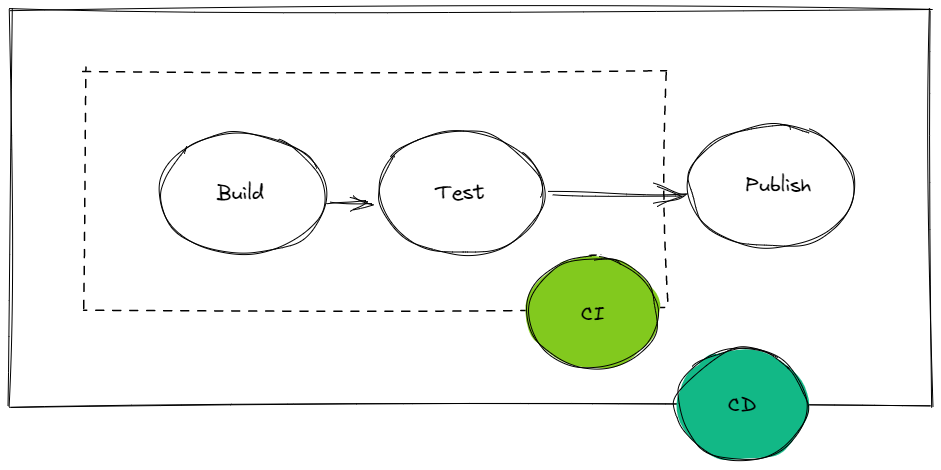
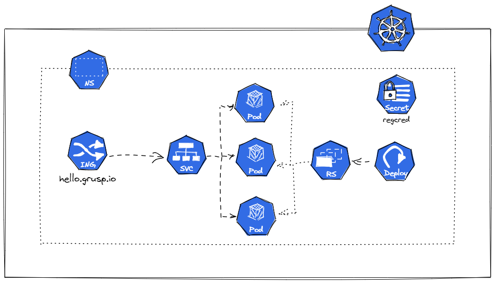

# MailUp - Demo presentazione Grusp 10 Marzo

In questa demo utilizzeremo Dagger per implementare una pipeline di ci/cd che permetta l'installazione di una semplice applicazione web su un cluster Kubernetes.

## Struttura

La radice contiene il codice relativo alla pipeline Dagger basata sul sdk go.
La directory infra utilizza il Cloud Development Kit for Kubernetes per l'installazione della applicazione sul cluster.
Nella directory hello c'è il codice vero dell'applicazione da esporre; verrà esposta al seguente [URL](https://hello.grusp.io).

## CI/CD Pipeline

La pipeline:



## Eseguire la pipeline nel notebook


```shell
export export HELLO_REPLICAS=3

mage demo:test
mage demo:publish
mage demo:deploy
```

## Eseguire la pipeline dal notebook

```shell
make connection;eval $(cat .env | sed 's/^/export /')

cat .argo-ci.yaml | argoci run grusp-demo - --branch="main"
```

## Smoke Test

```shell
curl -k https://hello.grusp.io/health
```

## Applicazione

"Architettura" dell'applicazione che verrà installata nel cluster K8s.



Possibile astrazione da fornire al team di sviluppo:

```go
type WebServiceProps struct {
	constructs.Construct
	Image           *string
	InternetFacing  bool
	Port            *float64
	ContainerPort   *float64
	HealthCheckPath string
	MemoryLimit     *float64
	CPULimit        *float64
	Replicas        *float64
}
```

Attuale configurazione del servizio:

```go
service.NewWebService(chart, jsii.String("hello"), &service.WebServiceProps{
	Image:           jsii.String(fmt.Sprintf("alvisevitturi/hello-grusp:%s", version)),
	InternetFacing:  true,
	Port:            jsii.Number(8080),
	ContainerPort:   jsii.Number(8080),
	HealthCheckPath: "/health",
	MemoryLimit:     jsii.Number(64),
	CPULimit:        jsii.Number(0.1),
	Replicas:        jsii.Number(replicas),
})
```

